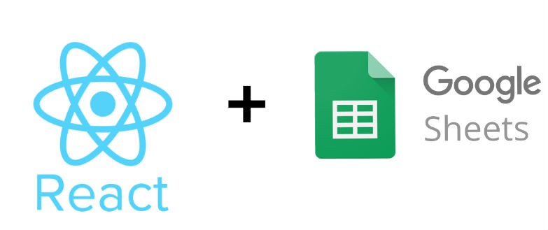

# Using React + Google Sheets as your CMS



---

[Source](https://medium.com/@ryan.mcnierney/using-react-google-sheets-as-your-cms-294c02561d59)

I’ll start this tutorial by admitting you shouldn’t actually use Google Sheets as your CMS for a production level site or project. However, a few use cases come to mind:

- For non-technical people to have write access to your “database”
- Ability to send any Google Sheet data to a react application
- React practice

By the end of this tutorial, you will be able to serve up any data from a Google Sheet into a real React app. Let’s get started.

---

For this tutorial, we are going to use create-react-app as our starting point. Why create-react-app? It’s simple to use (no wepback or babel configuration) and it works. First, create a new directory and cd into it.

```shell
npx create-react-app sheets-cms-demo
cd sheets-cms-demo
npm start
```

- nstructions for npm 5.1 or earlier
- Full details into create-react-app here

Your browser should open to localhost:3000 and display the following:


Now, we’ll jump into the code. Let’s take a quick look at the file structure create-react-app sets up automatically:

```markdown
sheets-cms-demo
├── README.md
├── node_modules
├── package.json
├── .gitignore
├── public
│   ├── favicon.ico
│   ├── index.html
│   └── manifest.json
└── src
    ├── App.css
    ├── App.js 
    ├── App.test.js
    ├── index.css
    ├── index.js
    ├── logo.svg
    └── registerServiceWorker.js
// App.js is where will will be making the majority of our changes.
```

Open App.js and inspect the main component that creates your browser view. Any saved changes made to App.js will automatically be reflected in your browser. See example of a change below:


Now that the react-app is set up, let’s head over to Google Sheets to build your “database”. For this tutorial, we are going to create a simple webpage that will display the favorite dogs of our employees. We will ask employees to fill out this sheet and have the responses reflected in our react app in real time.


Once we have some data, we can send it back to our react-app. The tool we will use to achieve this is Tabletop.js. Tabletop is a really simple npm package that allows us to take our Google Sheet data and export it as a JSON object. On the react side, we can take that JSON response and use it any way we want. Pretty cool.

*Important notes on your Google Sheet setup — Tabletop will export your data as an array. Each row will be created as an object with the column headers as the properties.*

- No empty column headers
- No empty rows. Tabletop will stop reading data if there are any blank rows

First, let’s install Tabletop into our project.

```npm install tabletop```

In order for Tabletop to read our data there are a few quick changes we will need to make to our Google Sheet settings.

1. Open the **File** menu and click ***Publish to web***
2. Towards the bottom select Start *publishing*. *The default setting will export the entire document. You can select a specific tab to export if needed. Tabletop will also by default only grab your first tab if you have multiple. The Tabletop docs have info on grabbing specific tabs*
3. Save your spreadsheet key. From the URL, your spreadsheet key will be the entire string after /spreadsheets/d/KEY/edit#gid=0


Back to react.

We will need to make a few updates to our App.js file before we start working with Tabletop. We will be adding a local state to this component so we can store the results from our Tabletop call and reflect any updates made in Google Sheets. Next, update the App.js file to include the following local state with our data initialized as an empty array. Remember, the response we are getting from Tabletop will be an array.

```javascript
import React, { Component } from 'react';
import logo from './logo.svg';
import './App.css';

class App extends Component {
  constructor() {
    super()
    this.state = {
      data: []
    }
  }
  render() {
    return (
      <div className="App">
        <header className="App-header">
          
          <h1 className="App-title">React + Google Sheets Demo</h1>
        </header>
      </div>
    );
  }
}

export default App;
```
